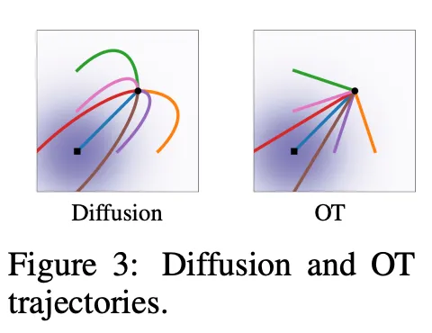

# 2. Optimal Transport Conditional VFs

From [Flow Matching for Generative Modeling](https://arxiv.org/pdf/2210.02747)

**Optimal Transport:** most efficient way to turn one prob dist into another (claude analogy: moving pile sand A to make pile B)

mean and stdev change linearly with time for straight line paths between start and end point

$$
\mu_t(x) = tx_1, \text{ and } \sigma_t(x) = 1 - (1 - \sigma_{\text{min}})t
$$

**Advantages**

1. OT path-made Vector Fields have consistent directions over time
2. OT paths always go directly
3. Very simple to learn
4. mathematically optimal path

**disadvantages:**

1. less stable training 
2. the noise of diffusion prevents mode collapse/acts as natural regularization
3. just because conditional flow of OT is optimal doesn't mean marginal VF is an sanoptimal transport solution
    

[[Prev]](./Diffusion%20Flow.md) [[Next]](../3.5:%20pi0/pi0.md)