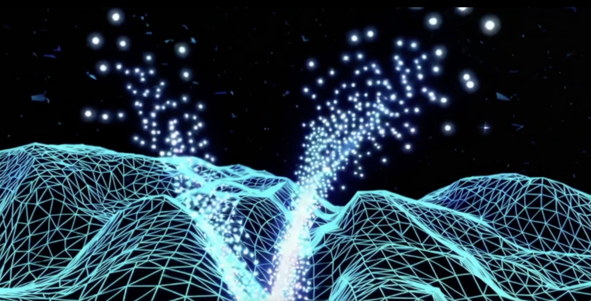

# Action Diffusion Handbook

From the fundamentals of diffusion to flow matching in pi0

## Contents: 

**0: Fundamentals**

0.1: Variational Generative Inference

0.2: Denoising Diffusion Probabilistic Models (DDPMs)

**1: Diffusion Policy** 

1.1: Action Diffusion

1.2: Components of Diffusion Policy

**2: Diffusion Transformer**

2.1: Diffusion Transformer (DiT)

2.2: Ingredients of Robotic Diffusion Transformers  

2.3: RDT-1B: Diffusion Foundation Model for Bimanual Manipulation

**3: Flow Matching**

3.1: Continuous Normalizing Flows

3.2: Flow Matching

3.3: Conditional Flow Matching

3.4: Diffusion and Optimal Transport Flows

3.5: pi0

### TODO: add repo contents walkthough
### TODO: add jupyter notebooks for each
### TODO: add paper links for VGI and DDPMs
### TODO: add header images 
### TODO: add section images
### TODO: Revise
